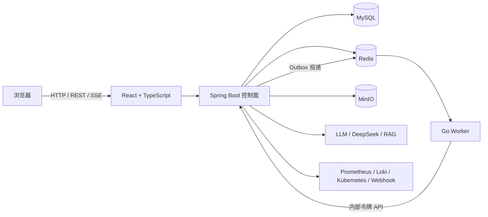

# PaiOps

> 面向服务器、Kubernetes、告警与故障处置的智能 Runbook / AIOps 平台。

[](https://adoptium.net/)
[](https://spring.io/projects/spring-boot)
[](https://react.dev/)
[](https://go.dev/)
[](./LICENSE)

PaiOps 将告警接入、指标/日志查询、AI 诊断、知识库检索、人工审批、受控修复、健康验证和审计串成一条可视化 DAG。它不是只有页面的演示项目：仓库包含 React 前端、Java 控制面、Go Worker、可靠任务队列、数据库结构、容器化部署和完整中文实战文档。

- GitHub: <https://github.com/SuperWangYU-8088/paiops>
- Gitee: <https://gitee.com/wang-yudddd/paiops>
- 完整文档: [docs/00-文档总览.md](./docs/00-文档总览.md)
- 从零部署: [docs/10-从零到一部署实战.md](./docs/10-从零到一部署实战.md)

## 核心能力

| 领域 | 已实现能力 |
| --- | --- |
| Runbook 编排 | React Flow 可视化 DAG、节点拖拽与连线、参数配置、条件分支、输入/输出引用、调试与 SSE 实时日志 |
| 执行可靠性 | MySQL Outbox、Redis 队列、Go Worker、分布式执行锁、锁续租、心跳、失联接管、超时、取消、重试、节点快照 |
| AIOps 闭环 | 告警、事件、Runbook、审批、动作、健康验证、关闭与复盘 |
| AI 与知识库 | OpenAI 兼容模型、DeepSeek、通义千问、智谱、RAG、知识分片与检索、ReAct Agent、Skills |
| 运维连接器 | Prometheus、Loki、Kubernetes、HTTP、Webhook、主机资源、数据库健康检查 |
| 生产安全 | AES-GCM 凭证加密、模型密钥脱敏、人工审批、RBAC、审计日志、Dry Run、回滚、出站地址白名单 |
| 可维护性 | Java/Go 单元测试、TypeScript 构建检查、ESLint、Docker Compose、升级/回滚/排障文档 |

工作流画布支持选中普通节点后按 `Delete` 或 `Backspace` 删除，也可使用配置区删除按钮；输入节点、输出节点和正在编辑的文本不会被快捷键误删。编辑器、运维中心、知识库和 MCP 页面均提供返回与主页导航。

## 系统架构



默认 Compose 启动六个服务：`frontend`、`backend`、`worker`、`mysql`、`redis`、`minio`。只有前端端口暴露到宿主机，其余服务在内部网络通信。

## 技术栈

- 前端：React 18、TypeScript、Vite、Ant Design、React Flow、Zustand
- 后端：Java 21、Spring Boot 3.4.1、Spring AI、MyBatis-Plus、JWT
- Worker：Go、go-redis
- 数据与基础设施：MySQL 8.4、Redis 7.4、MinIO、Docker Compose
- 工作流：确定性 DAG 引擎、LangGraph4j、Outbox + Worker 异步执行

## 快速开始

### 1. 环境要求

- Linux 服务器，推荐 Ubuntu 24.04
- 4 核 CPU、8 GiB 内存、30 GiB 可用磁盘
- Docker Engine 24+ 与 Docker Compose v2
- Git、OpenSSL、curl

### 2. 获取代码

任选一个仓库：

```bash
# GitHub
git clone https://github.com/SuperWangYU-8088/paiops.git

# 或 Gitee
git clone https://gitee.com/wang-yudddd/paiops.git

cd paiops
```

### 3. 生成部署配置

复制配置模板，并把全部 `CHANGE_ME` 替换为独立强随机值：

```bash
cp .env.deploy.example .env
chmod 600 .env
openssl rand -hex 24
openssl rand -hex 48
```

至少要配置以下项目：

```dotenv
MYSQL_ROOT_PASSWORD=CHANGE_ME
REDIS_PASSWORD=CHANGE_ME
MINIO_ACCESS_KEY=paiopsadmin
MINIO_SECRET_KEY=CHANGE_ME
JWT_SECRET=CHANGE_ME_AT_LEAST_32_CHARACTERS
PAIOPS_MASTER_KEY=CHANGE_ME
PAIOPS_WORKER_TOKEN=CHANGE_ME
PAIOPS_ALERT_WEBHOOK_TOKEN=CHANGE_ME
APP_AUTH_DEFAULT_USERNAME=admin
APP_AUTH_DEFAULT_PASSWORD=CHANGE_ME
```

`PAIOPS_MASTER_KEY` 用于解密已保存凭证，部署后必须与数据库备份一起保管，不能随意更换。生产环境不要把 `.env`、日志、数据库导出或真实 API Key 提交到 Git。

需要自动生成完整 `.env` 的命令，请直接执行[从零到一部署实战](./docs/10-从零到一部署实战.md)第 5 节中的脚本。

### 4. 构建并启动

```bash
docker compose config >/dev/null
docker compose --progress plain build --pull
docker compose up -d
docker compose ps
```

检查后端健康状态：

```bash
curl -fsS http://127.0.0.1/api/system/health
```

浏览器访问 `http://服务器地址/`，使用 `.env` 中的管理员账号登录。首次登录后应立即修改初始密码。

### 5. 常用维护命令

```bash
# 查看服务状态
docker compose ps

# 跟踪应用日志
docker compose logs -f --tail=200 backend worker frontend

# 停止服务（保留数据卷）
docker compose down

# 更新后重建并启动
git pull --ff-only
docker compose build
docker compose up -d
```

## 本地开发与测试

### 后端

```bash
mvn -f backend/pom.xml test
```

### Worker

```bash
cd worker
go test ./...
```

### 前端

```bash
cd frontend
npm ci
npm run build
npm run lint
```

当前交付基线已验证：Java 后端 `101/101` 测试通过、Go Worker 测试通过、前端 TypeScript/Vite 构建通过、ESLint 无错误。外部 Prometheus、Loki、Kubernetes 和告警平台需要使用者提供真实连接信息后再做联调。

## 项目结构

```text
paiops/
├── frontend/        React 运维工作台与可视化编辑器
├── backend/         Spring Boot API、工作流引擎与安全治理
├── worker/          Go 异步任务 Worker
├── docs/            设计、部署、使用、测试与二次开发文档
├── database/        数据库导出说明（真实数据不进入公开仓库）
├── compose.yaml     六服务部署编排
└── .env.deploy.example
```

## 学习路线

1. [从零到一部署实战](./docs/10-从零到一部署实战.md)：从空白 Ubuntu 完成部署。
2. [项目架构与代码导读](./docs/11-项目架构与代码导读.md)：理解一次任务如何经过 React、Java、MySQL、Redis 和 Go Worker。
3. [Runbook 编排与真实执行实战](./docs/12-Runbook编排与真实执行实战.md)：创建工作流并核对执行记录、节点快照和队列。
4. [DeepSeek 与知识库实战](./docs/13-DeepSeek与知识库实战.md)：配置真实模型、导入 SOP 并完成 RAG 检索。
5. [连接器、审批、审计与安全实战](./docs/14-连接器审批审计与安全实战.md)：接入测试环境并使用最小权限。
6. [二次开发与新增节点实战](./docs/15-二次开发与新增节点实战.md)：新增一个完整节点并补齐测试。

## 文档索引

| 文档 | 内容 |
| --- | --- |
| [总体设计](./docs/01-总体设计说明书.md) | 系统边界、组件关系与总体方案 |
| [执行引擎与可靠性](./docs/02-详细设计说明书-执行引擎与任务可靠性.md) | Outbox、队列、锁、心跳、接管与恢复 |
| [安全治理与事件闭环](./docs/03-详细设计说明书-安全治理与事件闭环.md) | 凭证、审批、RBAC、SSRF 与事件状态机 |
| [部署升级与回滚](./docs/04-部署升级与回滚手册.md) | 首次部署、升级、备份和回滚 |
| [日常运维与排障](./docs/05-日常运维与故障处理手册.md) | 巡检、日志、队列和常见故障处理 |
| [用户使用手册](./docs/06-用户使用手册.md) | Runbook、告警、任务、审批和事件操作 |
| [接口与集成](./docs/07-接口与外部系统集成手册.md) | REST、Webhook、SSE 与外部系统接入 |
| [公开测试报告](./docs/08-测试验证报告.md) | 测试范围、结果与未覆盖项 |
| [需求追踪矩阵](./docs/09-改造需求追踪矩阵.md) | 需求与代码、测试、配置、文档映射 |

## 安全说明

- 公开仓库不包含真实 `.env`、数据库全量导出、服务器账号、访问令牌或模型密钥。
- 告警自动执行仅允许全只读 DAG；带写操作的 Runbook 必须人工启动并经过审批。
- 高风险动作只认数据库中的有效审批事实，不接受前端参数伪造审批状态。
- SSE 使用短时、一次性票据；连接器凭证和模型密钥在数据库中加密保存。
- 发现安全问题时，请不要在公开 Issue 中粘贴密钥、日志或生产数据。

## 开源说明

PaiOps 基于 PaiAgent 的开源能力演进，并在 AIOps、可靠执行、审批审计、安全治理和中文交付文档方面进行了扩展。感谢 PaiAgent 原维护者 [itwanger](https://github.com/itwanger) 及相关开源项目贡献者。

本项目采用 [MIT License](./LICENSE)。
