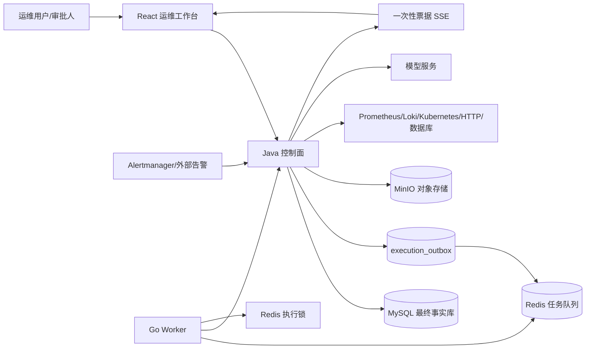
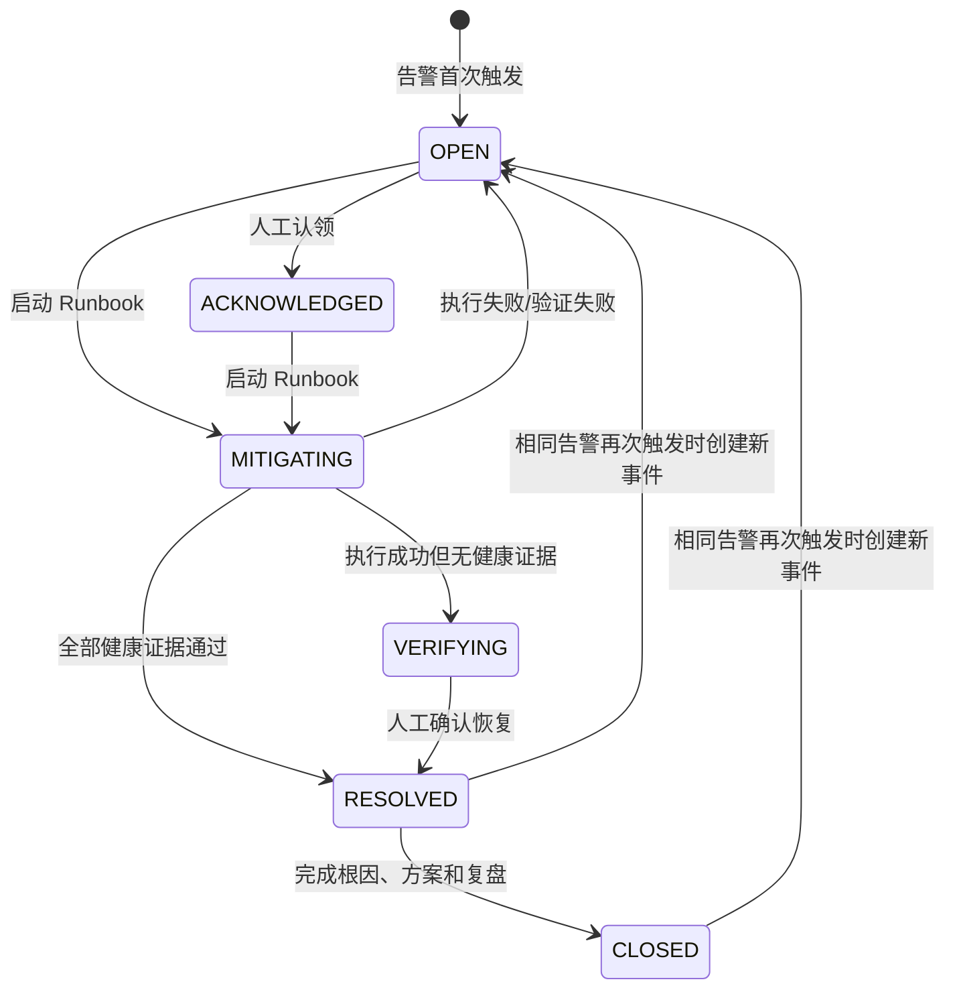

# PaiOps 总体设计说明书

## 1. 建设背景

原项目具备可视化工作流、DAG、LLM、RAG、ReAct、SSE 和多媒体节点，但核心形态仍偏向 AI 工作流原型。运维自动化与普通 AI 工作流的最大差别不是节点名称，而是责任边界：一次错误动作可能影响生产服务、数据和用户，因此平台必须具备确定性调度、身份认证、最小权限、人工审批、可取消、可接管、可回滚、全量审计和健康验证。

本次改造把产品定位调整为：

> 面向服务器、Kubernetes、告警和故障处置的，可审计、可审批、可恢复的智能 Runbook 编排平台。

AI 负责分析、解释和给出建议；DAG 与安全策略负责执行顺序和权限边界；Go Worker 负责可靠领取、锁、心跳与故障接管；数据库保存最终事实。

## 2. 建设目标

### 2.1 业务目标

- 统一接收 Alertmanager 风格的告警；
- 自动聚合成事件并累计重复告警次数；
- 关联标准 Runbook，收集指标、日志、Kubernetes 状态和知识库 SOP；
- 使用 AI 辅助诊断，但不把无限制写权限交给 AI；
- 在人工审批后执行受控的扩缩容、滚动重启和镜像回滚；
- 根据健康检查证据决定恢复、重新打开或等待人工验证；
- 保存审批、执行快照、任务日志、事件根因、处置方案和复盘记录。

### 2.2 工程目标

- API 请求快速返回，长任务异步执行；
- MySQL 与 Redis 之间不丢任务；
- Worker 崩溃时任务可以接管；
- 同一执行记录不会被多个 Worker 并发执行；
- 节点支持超时和运行中取消；
- 密钥不以明文通过查询接口返回；
- 高风险操作必须验证真实审批记录；
- 容器化部署可重复、可备份、可回滚。

## 3. 总体架构

### 3.1 前端工作台

前端使用 React 18、TypeScript、Ant Design、ReactFlow 和 Zustand。主要页面包括：

- 运维总览；
- 告警中心；
- 事件中心；
- Runbook 目录和可视化编辑器；
- 执行任务中心与节点快照详情；
- 连接器和凭证管理；
- 审批中心；
- 审计日志；
- 知识库和 MCP 工具。

图片、视频、TTS 等非运维核心能力不作为默认运维节点重点展示，仍保留兼容能力。

### 3.2 Java 控制面

Java 控制面承担所有业务事实和安全决策：

- JWT 登录、刷新令牌、一次性 SSE 票据；
- Runbook 保存、密钥字段拦截和 DAG 执行；
- 告警去重、事件创建、Runbook 路由和状态推进；
- 审批申请、并发审批保护、批准后的断点续跑；
- 凭证加解密、接口脱敏、出站访问控制；
- 执行记录、节点快照、变量、审计日志；
- Outbox 持久化和 Redis 投递重试；
- Worker 内部接口、心跳和失联任务扫描。

### 3.3 Go Worker

Go Worker 不持有 MySQL 密码，也不直接执行任意 Shell。它只使用：

- Redis 地址和密码；
- Java 控制面的内部 URL；
- 独立的 Worker Token。

职责包括：

- 用 `BRPOPLPUSH` 原子领取消息到处理中列表；
- 获取 `paiops:execution:lock:<id>` 分布式锁；
- 周期续租锁并发送心跳；
- 调用 Java 内部执行接口；
- 明确完成后确认消息；
- 网络中断时保留消息；
- 回收没有执行锁的处理中消息；
- 请求控制面重新入队心跳超时的任务。

### 3.4 数据层

MySQL 是最终事实库，保存 Runbook、任务、快照、审批、告警、事件、凭证、配置和审计。Redis 只承担队列、执行锁、短期 SSE 票据和临时协调；Redis 数据丢失不应改变 MySQL 中已经确认的业务事实。MinIO 保存上传文件和媒体对象。

## 4. 核心业务闭环

完整流程为：

1. 外部系统调用告警 Webhook；
2. 平台按 fingerprint 去重并更新 `ops_alert`；
3. firing 告警创建或更新 `ops_incident`，重复告警累加 `alert_count`；
4. 读取 `paiops_runbook_id` 路由 Runbook；
5. 只有 `paiops_auto_execute=true` 且 Runbook 全部为只读节点时才自动执行；
6. 写动作由用户在事件中心启动；
7. 任务写入 MySQL 与 Outbox，提交后投递 Redis；
8. Go Worker 领取并持锁，Java DAG 执行节点；
9. 人工审批节点使任务进入 `WAITING_APPROVAL`；
10. 审批通过后在原执行 ID 上从快照继续；
11. Kubernetes 动作默认 Dry Run，真实执行保存动作前后快照；
12. 健康节点输出布尔值 `healthy`；全部为真才能自动解决事件；
13. 人工填写根因、处置方案和复盘后关闭事件。

## 5. 风险分级

| 等级 | 典型节点 | 策略 |
|---|---|---|
| `READ_ONLY` | Prometheus、Loki、Kubernetes 查询、HTTP/主机/数据库健康检查、知识检索、AI 诊断 | 可用于只读自动 Runbook；仍受出站白名单和超时限制 |
| `LOW_RISK` | Webhook 通知、知识写入、媒体生成 | 需要登录和审计，不允许承载通用系统命令 |
| `GOVERNANCE` | 变更窗口、人工审批 | 负责流程控制，不直接等同于写权限 |
| `HIGH_RISK` | Kubernetes 扩缩容、重启、回滚及未知节点 | 必须存在属于当前执行、已批准、未过期的数据库审批记录 |

未知节点默认按 `HIGH_RISK` 处理，符合“默认拒绝”的安全原则。

## 6. 可靠性原则

### 6.1 不丢任务

任务记录和 Outbox 在同一 MySQL 事务中写入。Redis 不可用时，Outbox 保持 `PENDING` 并指数退避重试。这样避免事务尚未提交就发送 Redis，也避免数据库成功但消息丢失。

### 6.2 允许重复但不并发

网络中的严格“恰好一次”无法仅靠 Redis 保证。系统采用“至少一次投递 + 幂等键 + 执行锁 + 数据库状态校验”：

- API 的 `(flow_id, idempotency_key, deleted)` 唯一键阻止重复创建；
- Go Worker 的执行锁阻止并发执行；
- Java 控制面只允许合法状态被领取；
- Kubernetes 写动作采用结构化、趋向幂等的 Patch。

### 6.3 崩溃接管

每个消费槽位有独立处理中列表。Worker 崩溃时消息不会消失；锁 TTL 到期后，恢复协程把无锁消息原子搬回主队列。控制面还会扫描心跳过期的 `RUNNING` 任务，并以 `RESUME` 模式重新入队。

## 7. 安全架构

- 用户接口使用 JWT；敏感管理接口要求 `ADMIN` 角色；
- Worker 内部接口使用独立长随机令牌，并与浏览器 JWT 隔离；
- 告警入口使用独立 Webhook Token，常量时间比较；
- 数据库中的连接器和模型密钥采用 AES-GCM，带 `enc:v1:` 版本前缀；
- GET 配置接口只返回 `apiKeyConfigured`，不回显密钥；
- Runbook 保存前递归拒绝 `apiKey`、`password`、`secret`、`token` 和 Authorization；
- 出站 HTTP 只允许配置白名单主机，拒绝非法协议和未授权地址，不自动跟随重定向；
- MCP 自定义命令默认禁用，只允许代码内置受信任预设；
- Kubernetes 写动作只支持明确的扩缩容、重启、镜像回滚，不接收任意 JSON Patch 或 Shell；
- 高风险动作校验命名空间、Deployment 名、容器名、镜像名、replicas 范围、超时和凭证；
- SSE 使用 60 秒、一次消费票据，避免长期 JWT 落入 URL、代理日志和浏览器历史。

## 8. 数据模型摘要

| 表 | 用途 | 关键约束 |
|---|---|---|
| `workflow` | Runbook 定义 | flow_data 保存节点和边；保存时执行密钥策略 |
| `execution_record` | 任务主记录 | 状态、Worker、心跳、取消、幂等键、执行模式 |
| `execution_outbox` | MySQL→Redis 可靠发件箱 | PENDING/PROCESSING/SENT、退避和错误信息 |
| `execution_snapshot` | 节点级快照 | 输入、输出、耗时、重试、顺序、状态 |
| `execution_variable` | 断点续跑变量 | 执行 ID + 变量名唯一 |
| `approval_request` | 审批事实 | 执行 ID + 节点 ID 唯一；并发条件更新 |
| `ops_alert` | 告警 | fingerprint 唯一 |
| `ops_incident` | 事件 | Runbook、执行 ID、根因、处置、复盘 |
| `connector_credential` | 连接凭证 | 只存 AES-GCM 密文 |
| `llm_global_config` | 模型配置 | API Key 加密；接口不回显 |
| `audit_log` | 审计 | 操作者、动作、资源、结果、脱敏详情、IP |

## 9. 非目标与演进边界

本版本有意不提供“任意 Shell”“任意 Kubernetes Patch”“AI 自主调用生产写权限”。Jenkins/GitLab、Ansible、受控 Shell、云厂商写操作等可以在后续版本按同样模式增加专用节点，但必须先完成：结构化参数、凭证最小权限、Dry Run、审批、审计、幂等和回滚设计。不能通过打开 MCP 自定义命令来绕过这些边界。

## 10. 验收标准

- 六个容器启动并通过健康检查；
- 登录、工作台和主要 API 可访问；
- Java 全量测试通过；
- Go 全量测试通过；
- 前端生产构建通过；
- 未认证用户不能访问受保护 API；
- 模型和连接器密钥不会通过查询接口明文返回；
- 告警可创建事件，事件可启动 Runbook；
- 高风险节点没有真实审批时拒绝执行；
- 审批通过后原任务可断点续跑；
- Redis 短暂不可用时 Outbox 保留待投递记录；
- 最终代码和中文文档同步到约定服务器与本地目录。

