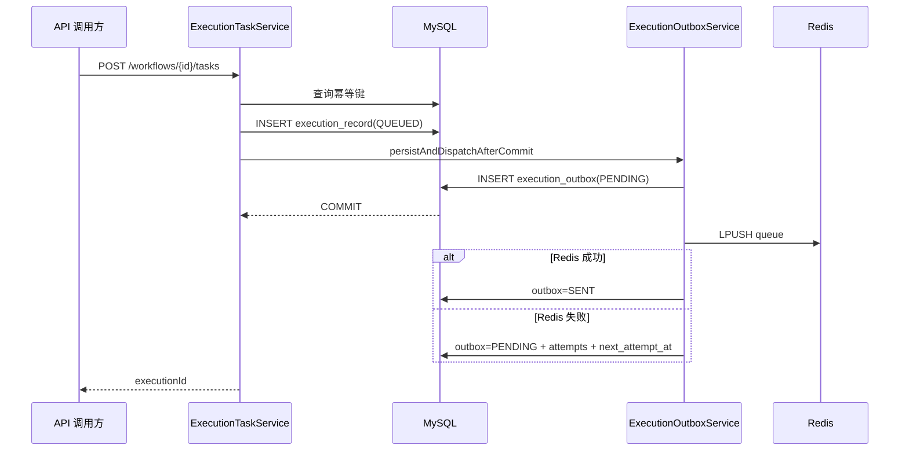

# 详细设计说明书：执行引擎与任务可靠性

## 1. 设计范围

本文详细说明异步任务从 API 提交到最终完成的全链路，包括 MySQL 事务、Outbox、Redis 队列、Go Worker、分布式锁、心跳、节点超时、取消、快照、审批暂停、断点续跑和故障接管。

## 2. 组件职责

| 组件 | 主要职责 | 不承担的职责 |
|---|---|---|
| `ExecutionTaskService` | 建任务、幂等检查、状态查询、取消、失联重排 | 不直接在事务内推 Redis |
| `ExecutionOutboxService` | 持久化投递意图、提交后投递、失败重试 | 不执行 Runbook |
| Redis 主队列 | 保存待领取消息 | 不作为任务最终状态库 |
| Redis processing 列表 | 保存已领取未确认消息 | 不决定任务是否完成 |
| Go Worker | 领取、锁、续租、心跳、调用控制面、回收 | 不持有数据库账号，不直接执行节点 |
| `ExecutionWorkerService` | 校验任务状态、设置 RUNNING、调用 DAG、写最终状态 | 不从 Redis 直接消费 |
| `WorkflowEngine` | 确定性拓扑执行、节点超时/取消、快照、暂停与恢复 | 不做 Worker 选主 |
| MySQL | 保存最终事实 | 不承担高频阻塞队列 |

## 3. 提交事务与 Outbox

### 3.1 提交顺序



禁止在数据库提交前直接发送 Redis。否则可能出现：

- Worker 已拿到消息，但数据库事务回滚，执行 ID 不存在；
- 数据库提交成功，进程在发送 Redis 前崩溃，任务永久停留在 `QUEUED`。

### 3.2 Outbox 状态机

| 状态 | 含义 | 转换 |
|---|---|---|
| `PENDING` | 等待投递或等待重试 | 条件领取后到 PROCESSING |
| `PROCESSING` | 某个后端实例正在投递 | 成功到 SENT；失败回 PENDING |
| `SENT` | Redis 已接收消息 | 终态；可按保留策略清理 |

领取通过 `WHERE id=? AND status='PENDING'` 条件更新，避免多个后端实例重复投递同一 Outbox 行。进程在领取后崩溃时，超过两分钟的 `PROCESSING` 会被重新置为 `PENDING`。

失败退避为 `min(300, 2^attempts)` 秒，最大五分钟。一次 `LPUSH` 成功但写 `SENT` 前崩溃可能产生重复消息；这是设计允许的，后续由执行锁和数据库状态去重。

## 4. 幂等设计

### 4.1 API 幂等键

调用方可传 `idempotencyKey`。数据库唯一键为：

```text
(flow_id, idempotency_key, deleted)
```

处理策略：

1. 先查询并直接返回已有任务，减少数据库异常；
2. 并发请求都未查到时，唯一键是最终屏障；
3. 捕获 `DuplicateKeyException` 后再查询并返回并发创建的任务。

告警自动执行使用 `alert:<fingerprint>:incident:<incidentId>`，同一次事件重复投递不会创建多个任务；相同告警恢复后再触发会生成新事件 ID，因此可以产生新的处置任务。

### 4.2 动作幂等

平台不承诺所有外部系统都支持严格幂等，但通过以下方式降低重复副作用：

- Kubernetes 扩缩容设置目标 replicas，天然趋向幂等；
- 镜像回滚设置目标镜像，重复设置结果一致；
- 滚动重启写入时间戳，属于非严格幂等动作，必须依赖执行锁、数据库状态和审批；
- 每个动作输出 `changeId`、beforeSnapshot、afterSnapshot，便于核对重复请求。

## 5. Redis 可靠消费

### 5.1 队列键

| 键 | 示例 | 用途 |
|---|---|---|
| 主队列 | `paiops:execution:queue` | 等待领取 |
| 处理中列表 | `paiops:execution:processing:<workerId>:<slot>` | 已领取未确认 |
| 执行锁 | `paiops:execution:lock:<executionId>` | 防并发执行 |

### 5.2 原子领取

Worker 使用 `BRPOPLPUSH`，把消息从主队列原子移动到 processing 列表。与 `BRPOP` 相比，即使 Worker 在领取后立即崩溃，消息仍然存在。

### 5.3 确认规则

以下情况才从 processing 列表 `LREM`：

- 控制面返回明确成功；
- 控制面返回明确 HTTP 或业务拒绝，说明请求已到达、数据库状态是权威事实；
- 当前执行锁被其他 Worker 持有，确认是重复消息；
- 消息 JSON 非法或缺少有效 executionId，确认是毒消息。

以下情况不确认：

- 连接控制面失败；
- 未完整读取控制面响应；
- Redis 锁操作失败。

不确认的消息会在锁释放/过期后被恢复协程重新投递。如果第一次请求实际已经执行完成，第二次请求会被 Java 的数据库终态拒绝，随后安全确认，不会再次执行 DAG。

## 6. 分布式锁与续租

### 6.1 获取

```text
SET paiops:execution:lock:<id> <workerId:nanotime> NX PX <ttl>
```

默认 TTL 90 秒，默认每 30 秒续租。配置层保证续租间隔小于 TTL 一半；配置不合理时自动收敛为 TTL 的三分之一。

### 6.2 续租

续租 Lua 脚本先比较 owner，再执行 `PEXPIRE`。发现锁不存在或 owner 不一致时立即取消控制面请求，防止原 Worker 与接管 Worker 并发写外部系统。

### 6.3 释放

释放也使用 compare-and-delete Lua，禁止直接 `DEL`。原因是旧锁可能已经过期并被其他 Worker 重新获取；直接删除会误删新持有者的锁。

## 7. 心跳与故障接管

Worker 默认每 10 秒调用一次心跳。控制面只接受当前 `worker_id` 对应任务的心跳。

失联条件：

- 状态为 `RUNNING`；
- 有 heartbeat 时，heartbeat 早于当前时间减 staleAfter；
- 从未 heartbeat 时，startedAt 早于阈值。

默认 staleAfter 90 秒，最小按 30 秒处理。失联任务被重置为：

```text
status=QUEUED
execution_mode=RESUME
worker_id=NULL
heartbeat_at=NULL
queued_at=NOW()
```

然后再次通过 Outbox 入队。恢复执行会加载成功快照，跳过已经完成的节点，降低重复副作用。

## 8. DAG 执行

### 8.1 确定性

运维异步任务只允许 `engineType=dag`。DAG 解析器执行环检测和拓扑排序，核心调度不交给 LLM。ReAct/LangGraph 可以作为诊断节点内部能力，但不能决定任务是否绕过审批或直接写生产。

### 8.2 节点输入

节点输入由前驱输出合并。运行时临时加入：

- `__executionId__`；
- `__flowId__`；
- 恢复时的已修改变量和快照输出。

双下划线字段只用于内部决策，写快照和响应前会剥离，避免泄漏内部标识或审批上下文。

### 8.3 节点超时

每个节点可配置 `nodeTimeoutSeconds`，范围 1–3600 秒，默认由 `PAIOPS_NODE_TIMEOUT_SECONDS` 提供（默认 300 秒）。Java 21 虚拟线程池执行节点，超时后调用 `Future.cancel(true)`。

### 8.4 运行中取消

用户调用取消接口后：

- `QUEUED`/`WAITING_APPROVAL` 直接转 `CANCELED`；
- `RUNNING` 转 `CANCEL_REQUESTED` 并设置 `cancel_requested=1`；
- DAG 在每个节点开始前检查；
- 长节点等待期间每秒检查一次，发现取消立即中断 Future；
- Worker 心跳允许 `CANCEL_REQUESTED`，直到 Java 完成状态收敛。

外部库必须正确响应线程中断。JDK HttpClient 的同步请求支持 InterruptedException；自定义新节点也必须遵守中断，不得吞掉中断后无限继续。

## 9. 节点快照与断点续跑

每个节点的快照包含：

- executionId、flowId；
- nodeId、nodeType、nodeName；
- 输入和输出 JSON；
- PENDING/RUNNING/SUCCESS/FAILED/WAITING_APPROVAL/CANCELED；
- startedAt、completedAt、duration；
- retryCount、executionOrder。

恢复流程：

1. 加载执行记录和快照；
2. 恢复成功节点的输出；
3. 恢复执行变量；
4. 确定 startNodeId；
5. 按拓扑顺序跳过已成功节点；
6. 从指定节点继续；
7. 仍使用同一 executionId，确保审批、审计、事件关联不分裂。

## 10. 审批暂停与恢复

人工审批节点第一次执行时创建 `PENDING` 审批单并抛出 `WorkflowPausedException`。引擎把任务和节点快照标为 `WAITING_APPROVAL`，不视为失败。

审批通过使用同一事务完成：

1. 条件更新审批 `PENDING→APPROVED`；
2. 把任务设为 `QUEUED/RESUME`；
3. 写入 Outbox；
4. 事务提交后投递 Redis。

并发审批通过 `WHERE id=? AND status='PENDING'` 保证只有一个成功。审批拒绝则任务转 `REJECTED`，不会续跑。

## 11. 状态定义

| 状态 | 含义 | 是否终态 |
|---|---|---|
| `QUEUED` | 已入库，等待 Worker | 否 |
| `RUNNING` | Worker 已领取 | 否 |
| `WAITING_APPROVAL` | 暂停等待审批 | 否 |
| `CANCEL_REQUESTED` | 已请求取消，正在中断 | 否 |
| `SUCCESS` | DAG 成功 | 是 |
| `FAILED` | 节点或引擎失败 | 是 |
| `CANCELED` | 已取消 | 是 |
| `REJECTED` | 审批拒绝 | 是 |

## 12. 容量与性能

- 默认 Worker 并发：2；可通过 `PAIOPS_WORKER_CONCURRENCY` 调整为 1–32；
- 单次 Outbox 调度最多处理 100 条；
- 单个 processing 列表每轮最多扫描 200 条；
- API 列表限制最大 300/500，防止无界查询；
- Worker 控制面响应体最大读取 4 MiB；
- 节点输出仍应主动控制大小，大日志应写 Loki/对象存储并只返回引用。

提高并发前必须评估外部系统限流、Java 容器内存、数据库连接池、LLM 并发额度和高风险动作冲突。

## 13. 可观测性

重点观测：

- `execution_record` 各状态数量与最长停留时间；
- `execution_outbox` PENDING 数、最大 attempts、最老 created_at；
- Redis 主队列和 processing 列表长度；
- 执行锁 TTL；
- Worker 日志中的 lock lost、heartbeat failed、requeued；
- 任务节点耗时和失败类型；
- 事件从 OPEN 到 RESOLVED 的平均时长。

具体巡检命令见《05-日常运维与故障处理手册》。

## 14. 故障场景推演

| 故障 | 系统行为 | 人工操作 |
|---|---|---|
| Redis 在提交时不可用 | Outbox 留 PENDING，指数退避 | 恢复 Redis，观察自动投递 |
| 后端在提交后崩溃 | Outbox 行仍存在，新后端重试 | 无需手工重建任务 |
| Worker 领取后崩溃 | processing 留消息，锁过期后回收 | 确认新 Worker 接管 |
| Worker 锁续租失败 | 取消控制面请求，不确认消息 | 检查 Redis 网络 |
| 控制面连接失败 | 不确认消息，稍后重投 | 检查 backend 健康 |
| 响应丢失但动作已完成 | 重投后数据库终态拒绝 | 审计 before/after 快照 |
| 用户取消长 HTTP 节点 | 一秒内发现标记并中断 | 检查最终 CANCELED |
| 审批并发点击 | 只有一个条件更新成功 | 另一用户收到已处理提示 |

