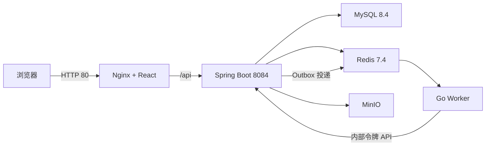

# PaiOps 从零到一部署实战

## 1. 这篇文档解决什么问题

本文给出从一台空白 Linux 服务器到 PaiOps 可以登录、可以执行 Runbook、可以调用 DeepSeek 的完整命令。命令以本次实际验收环境为基线：

- 操作系统：Ubuntu 24.04.4 LTS；
- Docker Engine：29.1.3；
- Docker Compose：2.40.3；
- 项目目录：`/opt/paiops-src`；
- 对外端口：`80`；
- 服务组成：MySQL、Redis、MinIO、Java 后端、Go Worker、React 前端。

命令默认由 `root` 执行。使用普通管理员账号时，请在系统命令前加 `sudo`。

## 2. 部署完成后的结构



只有前端端口暴露到宿主机。MySQL、Redis、MinIO、后端和 Worker 仅在 Compose 网络中通信。

## 3. 第一步：准备服务器

### 3.1 查看系统信息

```bash
cat /etc/os-release
uname -m
free -h
df -h /opt /var/lib/docker 2>/dev/null || true
timedatectl status
```

建议至少 4 核 CPU、8 GiB 内存、30 GiB 可用磁盘。最低可以用 2 核、4 GiB，但首次构建会更慢。

### 3.2 安装基础工具和 Docker

Ubuntu 24.04 可以直接使用发行版软件包：

```bash
apt-get update
apt-get install -y ca-certificates curl openssl docker.io docker-compose-v2
systemctl enable --now docker
docker version
docker compose version
```

如果系统已经安装 Docker，只要 `docker version` 和 `docker compose version` 均成功即可，不要重复安装。

### 3.3 检查防火墙

先查看状态，不要在远程 SSH 会话中盲目启用防火墙：

```bash
ufw status verbose
```

如果 UFW 已启用，放行 SSH 和 PaiOps 入口：

```bash
ufw allow 22/tcp
ufw allow 80/tcp
ufw status numbered
```

MySQL `3306`、Redis `6379`、MinIO `9000/9001` 和后端 `8084` 不需要对局域网开放。

## 4. 第二步：获取项目代码

### 4.1 从 GitHub 或 Gitee 克隆

在服务器执行，任选一个仓库：

```bash
# GitHub
git clone https://github.com/SuperWangYU-8088/paiops.git /opt/paiops-src

# 国内网络也可以使用 Gitee；与上面的命令二选一
# git clone https://gitee.com/wang-yudddd/paiops.git /opt/paiops-src
```

`192.0.2.10` 是本文使用的文档示例地址，实际执行 SSH、浏览器访问或接口测试时应替换为服务器真实地址。

### 4.2 在服务器验证文件

```bash
cd /opt/paiops-src
test -f compose.yaml
test -f .env.deploy.example
test -f backend/Dockerfile
test -f frontend/Dockerfile
test -f worker/Dockerfile
find docs -maxdepth 1 -type f -print
```

不能把最终交付目录放成 `/opt/paiops-src/paiops/...` 的双层结构。`compose.yaml` 必须直接位于 `/opt/paiops-src`。

## 5. 第三步：生成生产配置

### 5.1 一次性生成全部随机值

以下命令创建 `.env`，不会使用默认弱口令：

```bash
cd /opt/paiops-src
umask 077

MYSQL_ROOT_PASSWORD="$(openssl rand -hex 24)"
REDIS_PASSWORD="$(openssl rand -hex 24)"
MINIO_SECRET_KEY="$(openssl rand -hex 24)"
JWT_SECRET="$(openssl rand -hex 48)"
PAIOPS_MASTER_KEY="$(openssl rand -hex 48)"
PAIOPS_WORKER_TOKEN="$(openssl rand -hex 48)"
PAIOPS_ALERT_WEBHOOK_TOKEN="$(openssl rand -hex 48)"
ADMIN_PASSWORD="$(openssl rand -hex 20)"

cat > .env <<EOF
DOCKER_HUB_MIRROR=m.daocloud.io/docker.io
MAVEN_MIRROR_URL=https://maven.aliyun.com/repository/public
NPM_REGISTRY=https://registry.npmmirror.com
GOPROXY=https://goproxy.cn,direct
ALPINE_MIRROR=https://mirrors.aliyun.com/alpine

MYSQL_DATABASE=paiagent
MYSQL_ROOT_PASSWORD=${MYSQL_ROOT_PASSWORD}
REDIS_PASSWORD=${REDIS_PASSWORD}
MINIO_ACCESS_KEY=paiopsadmin
MINIO_SECRET_KEY=${MINIO_SECRET_KEY}

JWT_SECRET=${JWT_SECRET}
PAIOPS_MASTER_KEY=${PAIOPS_MASTER_KEY}
PAIOPS_WORKER_TOKEN=${PAIOPS_WORKER_TOKEN}
PAIOPS_ALERT_WEBHOOK_TOKEN=${PAIOPS_ALERT_WEBHOOK_TOKEN}

APP_AUTH_DEFAULT_USERNAME=admin
APP_AUTH_DEFAULT_PASSWORD=${ADMIN_PASSWORD}

PAIOPS_HTTP_ALLOWED_HOSTS=prometheus,loki,kubernetes.default.svc,localhost,127.0.0.1
PAIOPS_WORKER_CONCURRENCY=2
PAIOPS_HTTP_PORT=80
EOF

chmod 600 .env

cat > /root/paiops-admin-credentials.txt <<EOF
PaiOps 登录地址：http://$(hostname -I | awk '{print $1}')/
管理员账号：admin
管理员密码：${ADMIN_PASSWORD}
配置目录：/opt/paiops-src
EOF

chmod 600 /root/paiops-admin-credentials.txt
unset MYSQL_ROOT_PASSWORD REDIS_PASSWORD MINIO_SECRET_KEY JWT_SECRET
unset PAIOPS_MASTER_KEY PAIOPS_WORKER_TOKEN PAIOPS_ALERT_WEBHOOK_TOKEN ADMIN_PASSWORD
```

`PAIOPS_MASTER_KEY` 用于解密数据库中的凭证和模型密钥。它必须与数据库备份一起长期保存，不能在已有数据环境中随意重新生成。

### 5.2 扩展出站白名单

Prometheus、Loki、Kubernetes API 或 Webhook 使用真实域名时，将域名加入 `.env`：

```dotenv
PAIOPS_HTTP_ALLOWED_HOSTS=prometheus.example.com,loki.example.com,k8s-api.example.com,hooks.example.com
```

支持 `*.example.com`。生产环境不要配置为 `*`，也不要把不需要的内网网段全部放开。

### 5.3 检查配置但不打印密钥

```bash
cd /opt/paiops-src
test "$(stat -c '%a' .env)" = 600
if grep -q 'CHANGE_ME' .env; then echo '仍有占位符，停止部署'; exit 1; fi
docker compose config >/dev/null
echo "Compose 校验返回码：$?"
```

不要把 `docker compose config` 的完整输出粘贴到聊天或工单，因为它会展开密码和令牌。

## 6. 第四步：构建镜像

### 6.1 正式构建

```bash
cd /opt/paiops-src
docker compose --progress plain build --pull
```

首次构建会下载 Java、Node、Go 和基础镜像。项目已经配置以下加速源：

- Docker Hub：DaoCloud；
- Maven：阿里云；
- npm：npmmirror；
- Go：goproxy.cn；
- Alpine：阿里云。

网络短暂超时时直接重试同一命令，Docker 会复用已经完成的层。

### 6.2 可选的部署前测试

服务器安装了 Java 21 和 Maven 时：

```bash
cd /opt/paiops-src
JAVA_HOME=/usr/lib/jvm/java-21-openjdk-amd64 mvn -f backend/pom.xml test
```

Go 测试可以用容器运行，不需要在宿主机安装 Go：

```bash
cd /opt/paiops-src
docker run --rm \
  -v "$PWD/worker:/src" \
  -w /src \
  -e GOPROXY=https://goproxy.cn,direct \
  m.daocloud.io/docker.io/library/golang:1.24-alpine \
  go test ./...
```

前端的 `docker compose build frontend` 会执行 TypeScript 检查和 Vite 生产构建。

## 7. 第五步：启动六个服务

```bash
cd /opt/paiops-src
docker compose up -d
docker compose ps
```

正常启动顺序为：

1. MySQL、Redis、MinIO 先启动并通过健康检查；
2. Java 后端执行数据库自愈迁移并通过健康检查；
3. Go Worker 连接 Redis 和内部控制面；
4. 前端 Nginx 监听宿主机端口 80。

不要执行 `docker compose down -v`，该命令会删除数据库、Redis 和 MinIO 数据卷。

## 8. 第六步：逐项验收

### 8.1 HTTP 健康检查

```bash
curl -fsS http://127.0.0.1/api/system/health
```

预期核心字段：

```json
{"code":200,"data":{"status":"UP","application":"PaiOps"}}
```

### 8.2 容器状态和日志

```bash
docker compose ps
docker compose logs --tail=100 backend
docker compose logs --tail=100 worker
docker compose logs --tail=50 frontend
```

MySQL、Redis、MinIO、backend 应显示 `healthy`；frontend 和 worker 应保持 `running`。

### 8.3 数据库、Redis 和 MinIO

```bash
docker compose exec -T mysql sh -lc \
  'mysqladmin ping -h 127.0.0.1 -uroot -p"$MYSQL_ROOT_PASSWORD" --silent'

docker compose exec -T redis sh -lc \
  'redis-cli -a "$REDIS_PASSWORD" ping'

docker compose exec -T minio curl -fsS \
  http://127.0.0.1:9000/minio/health/live
```

预期分别返回 `mysqld is alive`、`PONG` 和成功状态。

### 8.4 首次登录

```bash
cat /root/paiops-admin-credentials.txt
```

浏览器打开 `http://服务器地址/`。登录后点击左下角锁形按钮修改密码。修改成功会让所有旧访问令牌和刷新令牌失效，需要使用新密码重新登录。

### 8.5 验证已有示例

打开“Runbook 目录”，交付数据中保留两条已经成功执行的示例：

- `01-平台最小执行示例`：验证数据库、Outbox、Redis、Go Worker 和 DAG 执行链；
- `02-DeepSeek真实调用示例`：验证模型配置、密钥解密和真实 DeepSeek 调用。

打开“执行任务”可以看到对应成功记录，打开眼睛图标可以查看节点快照。

## 9. 第七步：配置 DeepSeek

1. 打开任意 Runbook 编辑器；
2. 点击“模型管理”；
3. 新增或编辑 DeepSeek；
4. API 地址填写 `https://api.deepseek.com`；
5. 模型填写实际账号可用的模型名；
6. API Key 只在保存时填写，保存后页面只显示“已安全保存密钥”；
7. 新建大模型节点并选择该全局配置；
8. 调试执行，在“执行任务”查看输出和 Token 统计。

模型 Key 采用 `PAIOPS_MASTER_KEY` 驱动的 AES-GCM 加密存储，不会通过查询接口回传明文。

## 10. 第八步：配置外部系统

全部配置都可以在界面完成：

- “资源与连接器 → Kubernetes → 管理”：API 地址、命名空间、ServiceAccount Token、CA、kubeconfig；
- “资源与连接器 → Prometheus/Loki → 管理”：服务地址、Bearer Token 或 Basic Auth；
- “资源与连接器 → MinIO / S3 → 管理”：地址、Access Key、Secret Key、Bucket；
- “资源与连接器 → 告警系统 → 管理”：Alertmanager 地址和认证；
- “凭证管理”：查看已加密保存的字段名、更换密钥或删除凭证；
- “MCP 工具”：添加受信工具配置。

界面保存凭证后，接口只返回字段名，不返回密钥内容。

## 11. 常用重启和升级命令

只重建前端：

```bash
docker compose --progress plain build frontend
docker compose up -d frontend
```

只重建后端：

```bash
docker compose --progress plain build backend
docker compose up -d backend
```

重建后端和 Worker：

```bash
docker compose --progress plain build backend worker
docker compose up -d backend worker
```

完整升级：

```bash
cd /opt/paiops-src
docker compose --progress plain build
docker compose up -d
docker compose ps
curl -fsS http://127.0.0.1/api/system/health
```

## 12. 备份和恢复

### 12.1 备份数据库

```bash
cd /opt/paiops-src
install -d -m 700 /opt/paiops-backup
BACKUP_TS="$(date +%Y%m%d-%H%M%S)"
docker compose exec -T mysql sh -lc \
  'mysqldump --default-character-set=utf8mb4 -uroot -p"$MYSQL_ROOT_PASSWORD" --single-transaction --routines --triggers --events --hex-blob --databases paiagent' \
  | gzip > "/opt/paiops-backup/paiagent-${BACKUP_TS}.sql.gz"
test -s "/opt/paiops-backup/paiagent-${BACKUP_TS}.sql.gz"
```

### 12.2 备份密钥文件

```bash
cp -p .env "/opt/paiops-backup/env-${BACKUP_TS}"
chmod 600 "/opt/paiops-backup/env-${BACKUP_TS}"
```

数据库备份和 `.env` 必须成对保存。只有 SQL、没有原 `PAIOPS_MASTER_KEY` 时，数据库里的模型密钥和连接器凭证无法解密。

### 12.3 恢复

恢复前先停止写入服务，并对当前故障数据再做一次备份：

```bash
docker compose stop frontend worker backend
gunzip -c /opt/paiops-backup/paiagent-YYYYMMDD-HHMMSS.sql.gz \
  | docker compose exec -T mysql sh -lc \
  'mysql -uroot -p"$MYSQL_ROOT_PASSWORD"'
docker compose up -d backend worker frontend
```

## 13. 常见问题

### 13.1 前端能打开但接口 502

```bash
docker compose ps backend
docker compose logs --tail=200 backend
curl -fsS http://127.0.0.1/api/system/health
```

重点检查数据库密码、Master Key 长度、数据库迁移错误和 backend 健康状态。

### 13.2 Worker 不领取任务

```bash
docker compose logs --tail=200 worker
docker compose exec -T redis sh -lc \
  'redis-cli -a "$REDIS_PASSWORD" LLEN paiops:execution:queue'
```

检查 `PAIOPS_WORKER_TOKEN` 在 backend 和 worker 中是否一致、Redis 是否可达、Worker 是否持续发送心跳。

### 13.3 修改 `.env` 后没有生效

环境变量在容器创建时注入。修改后要重建容器：

```bash
docker compose up -d --force-recreate backend worker frontend
```

管理员默认密码只在首次创建用户时使用。数据库已有 `admin` 后，修改 `.env` 不会覆盖当前密码，应通过界面“修改密码”。

### 13.4 DeepSeek 返回 401 或模型不存在

- 重新进入“模型管理”，填写正确 Key；
- 确认 API 地址和模型名属于同一服务；
- 确认账号余额、模型权限和网络；
- 查看 backend 日志，但不要把完整请求头复制出来。

## 14. 最终验收清单

- [ ] 六个服务均在运行；
- [ ] 健康接口返回 `UP`；
- [ ] 管理员能登录并修改密码；
- [ ] 首页、告警、事件、Runbook、任务、连接器、凭证、审批、审计均可打开；
- [ ] 编辑器的返回、主页、知识库、MCP 工具按钮可来回切换；
- [ ] 节点可用 `Delete`、`Backspace` 和检查面板删除按钮删除；
- [ ] DeepSeek 真实请求成功；
- [ ] Redis 队列最终归零，Outbox 为 `SENT`；
- [ ] 数据库与 `.env` 已分别备份；
- [ ] 没有对外暴露 3306、6379、9000、8084。
