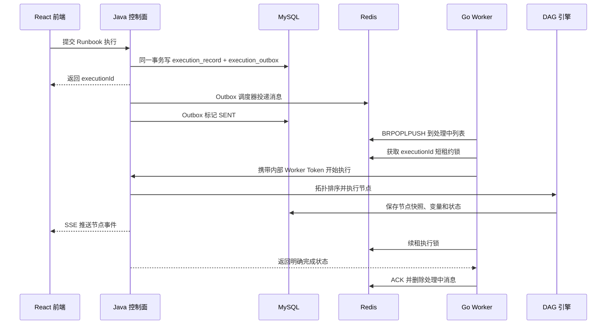
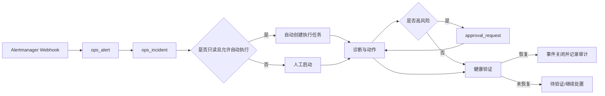

# PaiOps 项目架构与代码导读

## 1. 先建立正确理解

PaiOps 不是只展示卡片和流程图的前端空壳。它由三个可独立运行的程序和三个基础服务组成：

- React 前端负责运维工作台、Runbook 编辑器和配置页面；
- Java 控制面负责认证、流程定义、DAG 执行、模型、事件、审批、审计和数据持久化；
- Go Worker 负责可靠领取异步任务、心跳、锁续租、崩溃恢复和执行确认；
- MySQL 保存最终事实；
- Redis 保存队列、短租约锁和临时票据；
- MinIO 保存知识库和媒体对象。

AI 只负责诊断和内容生成，核心运维调度仍由确定性 DAG、审批事实和安全策略控制。

## 2. 一次任务到底怎样运行



这条链路解决了四个常见问题：

1. 数据库已写任务但 Redis 暂时不可用：Outbox 会重试，不丢任务；
2. Worker 领取任务后崩溃：消息仍在处理中列表，恢复协程会重新入队；
3. 两个 Worker 同时拿到同一执行：Redis 短租约锁只允许一个执行；
4. Worker 与控制面网络中断：没有收到明确成功响应就不 ACK，消息可重试。

## 3. 仓库目录怎样看

```text
paiops/
├─ backend/                         Java 21 + Spring Boot 控制面
│  ├─ pom.xml
│  └─ src/main/
│     ├─ java/com/paiagent/
│     │  ├─ controller/             REST API
│     │  ├─ service/                事务、业务编排和安全边界
│     │  ├─ engine/                 DAG、LangGraph、LLM、节点执行器
│     │  ├─ entity/                 数据实体
│     │  ├─ mapper/                 MyBatis-Plus Mapper
│     │  ├─ interceptor/            JWT、内部 Worker 鉴权
│     │  └─ config/                 安全、迁移、序列化和启动校验
│     └─ resources/
│        ├─ schema.sql              首次建库脚本
│        └─ application*.yml        应用配置
├─ frontend/                        React + TypeScript
│  └─ src/
│     ├─ pages/                     页面
│     ├─ components/                编辑器、导航、弹窗、调试抽屉
│     ├─ api/                       REST 请求封装
│     ├─ store/                     Zustand 状态
│     └─ utils/                     认证、模型、流程节点工具
├─ worker/                          Go Worker
│  ├─ cmd/paiops-worker/main.go
│  └─ internal/
│     ├─ config/                    环境变量
│     ├─ queue/                     Redis 可靠队列和 Lua 脚本
│     ├─ control/                   Java 内部 API 客户端
│     └─ worker/                    并发、续租、恢复、确认
├─ docs/                            中文设计、部署、使用和教程
├─ database/                        当前完整 SQL 导出
├─ compose.yaml                     六服务编排
└─ .env.deploy.example              无密钥配置模板
```

阅读顺序建议：先看 `compose.yaml`，再看 `frontend/src/App.tsx`，然后看后端 Controller 和 Service，最后看 Go Worker。

## 4. 前端怎样组织

### 4.1 路由

`frontend/src/App.tsx` 定义主要入口：

| 路径 | 页面 | 作用 |
|---|---|---|
| `/login` | `LoginPage` | 登录 |
| `/` | `OpsDashboardPage` | 运维总览 |
| `/alerts` | `AlertsPage` | 告警中心 |
| `/incidents` | `IncidentsPage` | 事件中心 |
| `/runbooks` | `RunbooksPage` | Runbook 目录 |
| `/tasks` | `ExecutionTasksPage` | 执行任务和节点快照 |
| `/connectors` | `ConnectorsPage` | 外部系统入口 |
| `/credentials` | `CredentialsPage` | 加密凭证 |
| `/approvals` | `ApprovalsPage` | 高风险审批 |
| `/audit` | `AuditLogsPage` | 审计日志 |
| `/editor/:id` | `EditorPage` | 可视化流程编辑器 |
| `/knowledge` | `KnowledgePage` | 知识库 |
| `/mcp-tools` | `McpToolPage` | 受控工具配置 |

页面使用懒加载，登录页不需要先下载 ReactFlow 和完整编辑器。

### 4.2 公共布局和导航

- `components/OpsLayout.tsx`：运维页面侧栏、页头和用户区；
- `components/AppNavigation.tsx`：返回上一页和回到主页；
- `pages/EditorPage.tsx`：编辑器顶栏包含模型、知识库、MCP、新建、加载、保存和调试；
- `components/FlowCanvas.tsx`：ReactFlow 画布、选中、删除键和连线；
- `store/workflowStore.ts`：节点、连线、选中状态和删除动作。

删除节点时不是只从画面上消失。Store 会同时清理关联边和选中状态。输入节点和输出节点属于必需节点，禁止删除；文本框内按退格不会误删画布节点。

### 4.3 API 和登录状态

- `api/request.ts` 统一附加访问令牌；
- `store/authStore.ts` 保存当前登录状态；
- 访问令牌失效时尝试刷新；
- 修改密码后后端提升 Token Version，旧访问令牌和刷新令牌全部失效。

## 5. Java 控制面怎样组织

### 5.1 Controller 是入口，不是核心逻辑

`backend/src/main/java/com/paiagent/controller` 中的主要控制器：

| 控制器 | 责任 |
|---|---|
| `AuthController` | 登录、刷新、登出、修改密码 |
| `WorkflowController` | Runbook CRUD、节点类型 |
| `ExecutionTaskController` | 异步任务、取消、详情、快照 |
| `ExecutionController` | 同步调试和 SSE |
| `AlertIncidentController` | 告警、事件、处置闭环 |
| `ApprovalController` | 审批单和决策 |
| `ConnectorCredentialController` | 加密凭证 CRUD |
| `LLMConfigController` | 全局模型配置和脱敏返回 |
| `KnowledgeBaseController` | 知识库、文档、分片和检索 |
| `McpToolConfigController` | 受信工具配置 |
| `InternalWorkerController` | 只给 Go Worker 调用的内部接口 |
| `AuditLogController` | 审计查询 |

Controller 做参数接收、权限声明和统一响应，事务与安全校验放在 Service 和 Engine 层。

### 5.2 DAG 引擎

核心类位于 `engine/` 和 `engine/dag/`。主要步骤：

1. 读取 `workflow.flow_data` JSON；
2. 校验节点和边；
3. 做拓扑排序与环检测；
4. 为节点准备上游输入；
5. 通过 `NodeExecutorFactory` 找执行器；
6. 执行超时、重试、取消检查；
7. 保存 `execution_snapshot` 和变量；
8. 推送执行事件；
9. 汇总最终输出并更新执行记录。

`NodeExecutorFactory` 自动收集所有 Spring `NodeExecutor` Bean，根据 `getSupportedNodeType()` 建立映射。新增节点时不需要在工厂里手写 `switch`。

### 5.3 节点执行器

节点实现位于 `engine/executor/impl/`，包括：

- 输入、输出、条件分支；
- HTTP 健康检查；
- Prometheus、Loki、Kubernetes 查询；
- 主机和数据库健康检查；
- Webhook 通知；
- DeepSeek/OpenAI 兼容模型与 Agent；
- 人工审批和变更门禁；
- Kubernetes 扩缩容、滚动重启、镜像回滚。

高风险 Kubernetes 动作使用统一执行器，根据节点类型分支。默认 Dry Run，真实写入会查数据库审批事实并保存前后快照。

### 5.4 密钥和出站安全

- `CredentialCryptoService` 使用 `PAIOPS_MASTER_KEY` 做 AES-GCM；
- 查询模型和连接器时只返回“已配置”和字段名；
- 保存 Runbook 时拒绝内嵌 API Key、Token、密码；
- 出站 HTTP 校验协议、主机白名单和内网地址策略；
- MCP 进程只允许受信预设；
- 内部 Worker API 必须携带独立 `PAIOPS_WORKER_TOKEN`。

## 6. Go Worker 怎样组织

### 6.1 为什么单独用 Go

Worker 的工作是高并发等待队列、维持短租约锁和可靠恢复。Go 的 goroutine、context 和静态二进制适合这类常驻进程，也满足本次改造优先使用 Go 的要求。

### 6.2 启动流程

`worker/cmd/paiops-worker/main.go`：

1. 从环境变量加载配置；
2. 创建 Redis 客户端；
3. 创建 Java 控制面客户端；
4. 启动指定数量的消费 goroutine；
5. 启动处理中消息恢复协程；
6. 收到退出信号后取消 context 并等待收尾。

### 6.3 可靠消费

`internal/queue/redis.go` 使用 `BRPOPLPUSH`，把消息从主队列原子移动到 Worker 专属处理中列表。成功完成后才用 `LREM` ACK。

恢复协程扫描 `paiops:execution:processing:*`：

- 执行已完成：清理残留消息；
- 执行仍有效且 Worker 存活：不抢占；
- Worker 失联且任务超时：重新放回主队列；
- 无法确认控制面状态：保留消息，下一轮再检查。

### 6.4 锁和心跳

- 执行锁 TTL：90 秒；
- 续租周期：30 秒；
- Worker 心跳：10 秒；
- 恢复扫描：30 秒；
- 失联判定：90 秒。

锁值包含 Worker 身份，续租和释放通过 Lua 比较后操作，避免一个 Worker 误删另一个 Worker 的锁。

## 7. 数据库表怎样分组

当前完整库包含 20 张表：

### 7.1 用户与配置

- `app_user`：用户、密码哈希、Token Version；
- `llm_global_config`：模型地址、模型名、加密 Key；
- `connector_credential`：连接器类型、加密 JSON；
- `mcp_tool_config`：工具配置；
- `node_definition`：基础节点元数据。

### 7.2 Runbook 和执行

- `workflow`：流程定义 JSON；
- `execution_record`：任务事实和最终状态；
- `execution_outbox`：可靠投递；
- `execution_snapshot`：每个节点的输入、输出、错误、耗时；
- `execution_variable`：流程运行变量。

### 7.3 运维治理

- `ops_alert`：归一化告警；
- `ops_incident`：事件和处置状态；
- `approval_request`：审批事实；
- `audit_log`：关键操作审计。

### 7.4 知识和记忆

- `knowledge_base`、`knowledge_document`、`knowledge_chunk`、`knowledge_index_task`；
- `agent_memory`、`agent_memory_embedding`。

## 8. 告警到事件闭环



告警标签可携带 `paiops_runbook_id`。只有全只读 DAG 才允许自动执行；包含写节点的流程必须人工发起并审批。

## 9. 如何证明不是空壳

本次交付数据库保留了可复核证据：

- Runbook `#1` 已由 Go Worker 异步执行成功；
- `execution_record #1` 包含两个成功节点，耗时 333 ms；
- Outbox 状态为 `SENT`，Redis 主队列和处理中列表均归零；
- Runbook `#2` 已真实调用 DeepSeek；
- `execution_record #2` 输出 `PAIOPS_DEEPSEEK_OK`，总耗时 1863 ms；
- 告警和事件各有一条已恢复验收记录；
- 审计日志包含执行、告警接入和密码修改事件。

打开界面“执行任务 → 查看详情”可以看到节点级输入、输出、耗时和状态；直接查询 `execution_record` 与 `execution_snapshot` 也能复核。

## 10. 推荐阅读和动手顺序

1. 阅读本文，理解请求怎样穿过三个程序；
2. 按《10-从零到一部署实战》在测试机部署；
3. 按《12-Runbook编排与真实执行实战》创建并执行流程；
4. 按《13-DeepSeek与知识库实战》完成真实 AI 与 RAG；
5. 按《14-连接器审批审计与安全实战》接入测试 Kubernetes；
6. 按《15-二次开发与新增节点实战》增加一个只读节点并补测试。
