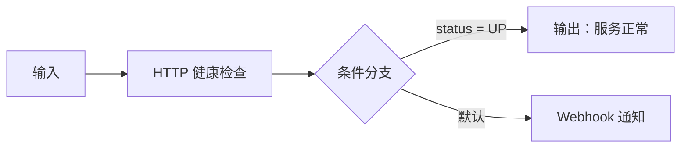

# PaiOps Runbook 编排与真实执行实战

## 1. 实战目标

完成本文后，你应能：

- 看懂交付系统中的两条成功示例；
- 从零创建一条平台健康巡检 Runbook；
- 正确连接节点、配置参数、保存和调试；
- 使用三种方式删除节点；
- 在各功能页面之间返回和回到主页；
- 从执行任务、数据库、Outbox 和 Redis 四个角度确认流程真的运行了。

## 2. 先验收交付示例

### 2.1 平台最小执行示例

登录后进入“Runbook 目录”，打开 `01-平台最小执行示例`。这条流程验证最小确定性链路：


它对应数据库 `workflow.id = 1`，已有一条异步成功记录：

| 项目 | 实际值 |
|---|---|
| 执行记录 | `execution_record.id = 1` |
| 模式 | `START` |
| 状态 | `SUCCESS` |
| Worker | `b20e2b5269cd-1` |
| 节点数 | 2 |
| 总耗时 | 333 ms |
| 输出 | `部署验收成功` |

这条记录证明数据库任务、Outbox、Redis、Go Worker、Java DAG 和节点快照链路都发生过真实数据写入。

### 2.2 DeepSeek 真实调用示例

打开 `02-DeepSeek真实调用示例`。它对应 `workflow.id = 2`，已有一次真实模型调用：

| 项目 | 实际值 |
|---|---|
| 执行记录 | `execution_record.id = 2` |
| 状态 | `SUCCESS` |
| 节点 | `deepseek-acceptance` |
| 输出 | `PAIOPS_DEEPSEEK_OK` |
| 输入 Token | 15 |
| 输出 Token | 45 |
| 总 Token | 60 |
| 总耗时 | 1863 ms |

它不是前端写死的演示文字，输出和 Token 统计保存在执行记录中。

## 3. 认识编辑器

编辑器分成四个区域：

1. 顶部工具栏：流程名、引擎、返回、主页、模型、知识库、MCP、新建、加载、保存、调试；
2. 左侧节点库：观测诊断、智能诊断、通知动作、流程治理；
3. 中间画布：节点、边、缩放、适配视图和小地图；
4. 右侧检查面板：当前节点的业务配置和删除按钮。

Runbook 最终保存在 `workflow.flow_data` JSON 中。画布位置用于编辑器展示，节点 `data` 才是执行参数。

## 4. 从零创建平台健康巡检

### 4.1 新建流程

1. 点击“新建 Runbook”；
2. 流程名称填写 `平台健康巡检实战`；
3. 引擎选择 `DAG 引擎`；
4. 保留自动生成的输入节点和输出节点。

DAG 适合确定性运维流程。LangGraph 适合需要状态图和动态路由的 AI 逻辑，但不应承担核心生产动作调度。

### 4.2 添加 HTTP 健康检查

从左侧“观测与诊断”把“HTTP 健康检查”拖到输入和输出之间。选中节点，在右侧配置：

| 字段 | 自检示例 |
|---|---|
| 检查地址 | `http://localhost:8084/api/system/health` |
| 请求方法 | `GET` |
| 超时 | `10` 秒 |
| 最小状态码 | `200` |
| 最大状态码 | `299` |
| 认证 | 留空 |

`localhost:8084` 是后端容器内的控制面，用于平台自检。生产 Runbook 应填写实际目标，并把目标主机加入 `PAIOPS_HTTP_ALLOWED_HOSTS`。

### 4.3 连接节点

按下面顺序连线：


不要只把节点放到画布上。没有边时，数据依赖和执行顺序不会按预期建立。

### 4.4 配置输出

选中输出节点，设置固定响应或引用健康检查结果。最小验证可以填写：

```text
平台健康检查已完成
```

需要返回完整节点结果时，在输出参数里选择“引用”，指向 HTTP 节点的输出字段。

### 4.5 保存

点击“保存”。成功后浏览器地址会包含流程 ID，例如 `/editor/4`。再进入“Runbook 目录”应能看到该流程。

保存失败时先检查：

- 流程名是否为空；
- 必需节点是否存在；
- 节点配置必填项是否完整；
- 是否把 API Key 或 Token 直接写进流程；
- 浏览器登录是否过期。

Runbook 安全策略会拒绝内嵌密钥。认证信息应放到“凭证管理”或“模型管理”。

## 5. 调试执行

### 5.1 打开调试

保存后点击“调试”。输入可以使用：

```json
{
  "source": "manual-test",
  "message": "检查 PaiOps 控制面"
}
```

启动后观察节点状态。调试面板通过一次性 SSE 票据接收事件，不把长期 JWT 放进 URL。

### 5.2 正常结果

应该依次看到：

1. 输入节点成功；
2. HTTP 健康检查返回 2xx；
3. 输出节点成功；
4. 执行状态变为 `SUCCESS`；
5. “执行任务”中出现记录；
6. 详情中有每个节点的输入、输出、状态和耗时。

### 5.3 失败结果也有价值

把地址临时改成一个无法连接的允许目标，可以验证：

- 节点超时；
- 错误信息写入快照；
- 后续节点不会被误标成功；
- 总任务状态变为失败；
- 审计和任务详情可追踪。

测试后恢复正确地址。

## 6. 节点删除和保护规则

### 6.1 三种删除方式

选中一个新添加的普通节点后，可以：

1. 按键盘 `Delete`；
2. 按键盘 `Backspace`；
3. 点击右侧检查面板的删除图标。

删除时会同时清理：

- 当前节点；
- 与它相连的所有边；
- 当前选中状态；
- 右侧检查面板内容。

### 6.2 不会误删的情况

- 输入节点和输出节点是必需节点，禁止删除；
- 光标位于输入框、文本域、可编辑元素时，`Backspace` 和 `Delete` 只编辑文字；
- 未选中节点时按删除键不会改变画布；
- 删除后保存才会把变化持久化到数据库。

## 7. 页面之间来回切换

### 7.1 编辑器顶部

- 左箭头：返回上一页；
- 主页图标：回到运维总览；
- 模型管理：配置 DeepSeek 等模型；
- 知识库：进入知识库；
- MCP 工具：进入工具管理。

直接粘贴地址打开编辑器且没有历史页面时，左箭头会安全回到主页，不会停在空白页。

### 7.2 运维页面

告警、事件、Runbook、任务、连接器、凭证、审批和审计都使用统一侧栏。页头同样有“返回上一页”和“回到主页”。

### 7.3 知识库和 MCP

两个独立工具页的左上角也有返回和主页按钮，可以从编辑器进入后再返回原流程。

## 8. 条件分支实战

创建下面流程：



条件分支节点使用稳定标识 `IF`。为每条分支配置字段、操作符和期望值，最后保留默认分支。

执行引擎只执行选中的分支，其他分支节点记录为跳过，不会把两个分支都执行。

## 9. Kubernetes 动作的正确练习方式

在没有测试集群前，只使用 Dry Run：

1. 在“资源与连接器 → Kubernetes → 管理”填写测试集群最小权限凭证；
2. 添加“Kubernetes 扩缩容”或“滚动重启”；
3. 保持 Dry Run 开启；
4. 配置命名空间和工作负载；
5. 调试并查看 before/patch 快照；
6. 确认没有真实资源发生变化。

关闭 Dry Run 后属于高风险动作。系统必须找到属于当前执行、状态已批准且未过期的数据库审批单。前端传入 `approved=true` 不会绕过校验。

## 10. 从数据库验证真实执行

进入服务器项目目录：

```bash
cd /opt/paiops-src
```

### 10.1 查看执行记录

```bash
docker compose exec -T mysql sh -lc \
  'mysql --default-character-set=utf8mb4 -uroot -p"$MYSQL_ROOT_PASSWORD" paiagent -e \
  "SELECT id,flow_id,status,duration,worker_id,execution_mode,executed_at FROM execution_record WHERE deleted=0 ORDER BY id DESC LIMIT 20"'
```

### 10.2 查看节点快照

```bash
docker compose exec -T mysql sh -lc \
  'mysql --default-character-set=utf8mb4 -uroot -p"$MYSQL_ROOT_PASSWORD" paiagent -e \
  "SELECT execution_id,node_id,node_name,status,duration,retry_count,error_message FROM execution_snapshot ORDER BY id DESC LIMIT 50"'
```

### 10.3 查看 Outbox

```bash
docker compose exec -T mysql sh -lc \
  'mysql -uroot -p"$MYSQL_ROOT_PASSWORD" paiagent -e \
  "SELECT id,execution_id,status,retry_count,next_retry_at,last_error FROM execution_outbox ORDER BY id DESC"'
```

成功任务最终应为 `SENT`。持续 `PENDING` 或 `FAILED` 表示 Redis 投递有问题。

### 10.4 查看 Redis 队列

```bash
docker compose exec -T redis sh -lc \
  'redis-cli -a "$REDIS_PASSWORD" LLEN paiops:execution:queue'

docker compose exec -T redis sh -lc \
  'redis-cli -a "$REDIS_PASSWORD" --scan --pattern "paiops:execution:processing:*"'
```

空闲状态下主队列长度应为 `0`，也不应残留处理中键。

## 11. 取消、超时和重试

- 取消请求先写入 `execution_record.cancel_requested`；
- DAG 在节点之间检查取消；
- 长时间 HTTP 节点每秒检查取消标记并中断；
- 节点超时由配置限制，不能无限挂起；
- 重试次数记录在节点快照；
- 同一业务请求可使用幂等键，避免重复创建执行。

取消不是删除历史。任务仍保留状态、节点快照和审计记录。

## 12. 实战验收清单

- [ ] 两条交付示例都能打开；
- [ ] 执行任务能看到 `#1` 和 `#2` 成功证据；
- [ ] 新建流程能保存并重新加载；
- [ ] HTTP 节点能真实访问健康接口；
- [ ] 节点三种删除方式都有效；
- [ ] 输入框退格不会误删节点；
- [ ] 输入、输出节点不能删除；
- [ ] 返回和主页按钮在编辑器、知识库、MCP、运维页面都有效；
- [ ] 任务详情能看到节点输入、输出和耗时；
- [ ] Outbox 已发送，Redis 队列归零。
