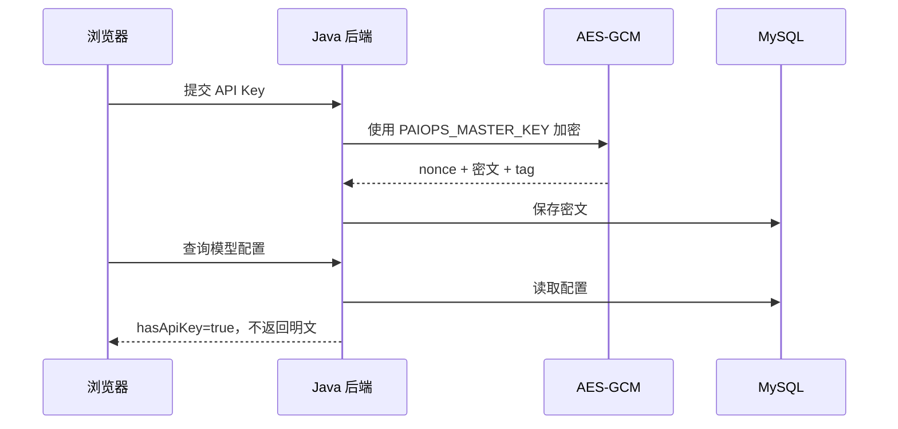

# PaiOps DeepSeek 与知识库实战

## 1. 实战目标

本文覆盖两条不同链路：

1. DeepSeek 对话模型：输入问题，模型生成诊断结果；
2. RAG 知识库：导入 SOP，分片、向量化、检索，再把命中内容交给模型。

DeepSeek 对话和向量模型不是同一能力。只有 DeepSeek Chat 配置时可以完成真实对话，但知识库向量索引还需要一个支持 Embedding 的配置。

## 2. 当前已验证的 DeepSeek 配置

交付环境已经保存一条全局配置：

| 字段 | 当前值 |
|---|---|
| 提供商 | DeepSeek |
| API 地址 | `https://api.deepseek.com` |
| 模型 | `deepseek-v4-flash` |
| API Key | 已使用 AES-GCM 加密保存，接口不回显 |
| 配置 ID | `1` |

实际验收执行返回：

```json
{
  "content": "PAIOPS_DEEPSEEK_OK",
  "inputTokens": 15,
  "outputTokens": 45,
  "totalTokens": 60
}
```

执行状态为 `SUCCESS`，模型节点耗时 1766 ms，总执行耗时 1863 ms。

## 3. 在界面配置 DeepSeek

### 3.1 打开模型管理

1. 进入任意 Runbook 编辑器；
2. 点击顶部“模型管理”；
3. 点击“新增配置”或现有 DeepSeek 的“编辑”。

### 3.2 字段填写

| 字段 | 说明 |
|---|---|
| 提供商 | `DeepSeek` |
| API 地址 | `https://api.deepseek.com` |
| API 密钥 | DeepSeek 控制台创建的 Key |
| 默认 LLM 模型 | 账号实际可用的模型名 |
| 能力配置 | 只有服务明确支持时才添加 TTS、Embedding 等能力 |

编辑现有配置时，API 密钥输入框留空表示保留旧 Key。页面显示“已安全保存密钥”说明数据库中已有密文。

### 3.3 密钥存储链路



Runbook 节点只保存 `configId`，不保存 Key。执行时后端按 ID 读取并解密。

## 4. 创建一条完整 DeepSeek 诊断流程

### 4.1 画布结构


### 4.2 模型节点建议配置

| 字段 | 实战值 |
|---|---|
| 全局模型配置 | 当前 DeepSeek 配置 |
| 温度 | `0.2`，运维诊断保持稳定 |
| 最大步骤 | 普通 LLM 节点不需要 Agent 多步工具 |
| 流式输出 | 调试时可开，固定验收时可关 |
| Prompt | 使用下面模板 |

```text
你是 PaiOps 运维诊断助手。
只根据输入中的事实回答，不编造不存在的指标、日志或资源。
按以下格式输出：
1. 现象摘要
2. 可能原因，按置信度排序
3. 建议先执行的只读检查
4. 需要人工确认的风险

输入：{{input}}
```

### 4.3 固定连通性验收

排查模型配置时，先把 Prompt 改成：

```text
请只回复 PAIOPS_DEEPSEEK_OK
```

温度设置为 `0`，关闭工具和知识库。这样可以把“模型连通问题”和“复杂 Prompt/RAG 问题”分开。

### 4.4 执行输入

```json
{
  "input": "验收调用"
}
```

若成功，再恢复正式诊断 Prompt。

## 5. DeepSeek 常见错误

### 5.1 401 或 403

- Key 错误、被禁用或没有模型权限；
- API 地址和 Key 不属于同一平台；
- 编辑配置时误把脱敏占位符当新 Key 保存；
- 系统时间严重偏差。

处理方法：在模型管理中重新填写真实 Key，保存后立即做固定连通性验收。

### 5.2 模型不存在

模型名必须以当前账号和 DeepSeek 官方接口实际支持为准。不要只根据旧文档猜模型名。先在 DeepSeek 控制台确认，再修改“默认 LLM 模型”。

### 5.3 429

表示额度、QPS 或并发限制。降低 Worker 并发和调用频率，检查账号余额与速率限制。不要对 429 做无限重试。

### 5.4 超时或网络错误

```bash
cd /opt/paiops-src
docker compose logs --tail=200 backend
docker compose exec -T backend wget -S -O /dev/null https://api.deepseek.com 2>&1 || true
```

只验证网络和 TLS，不要在命令行附带 API Key。

## 6. 创建知识库

### 6.1 当前支持范围

当前版本支持：

- 直接粘贴文本；
- 上传 `.txt`、`.md`、`.markdown`；
- 分片预览；
- 异步索引任务；
- 相似度检索测试；
- Runbook 模型节点引用知识库。

当前版本不直接解析 PDF、Word、Excel。需要先转换成 Markdown 或纯文本。

### 6.2 新建“运维知识库”

进入“知识库”，点击“新建知识库”，建议填写：

| 字段 | 示例 |
|---|---|
| 名称 | `生产运维 SOP` |
| 描述 | `保存告警处理手册、架构说明、已知故障和回滚步骤` |
| Agent Plan 配置 | 选择具有向量能力的配置 |
| 向量模型 | 该配置实际支持的 Embedding 模型 |
| 分片长度 | `800` |
| 重叠长度 | `100` |

`chunkOverlap` 必须小于 `chunkSize`。SOP 段落较短时可使用 500/80，长篇架构文档可使用 1000/150，再通过检索测试调优。

## 7. 准备一份可检索 SOP

创建 Markdown 文件：

```markdown
# 支付服务 CPU 告警处理 SOP

## 适用条件

- 服务：payment-api
- 告警：CPU 使用率连续 10 分钟大于 85%

## 只读检查

1. 查询最近 30 分钟 CPU、请求量和错误率。
2. 查询 Pod 重启次数和 Kubernetes Event。
3. 查询慢请求和异常堆栈。

## 处置原则

- 流量增长且错误率正常：申请扩容。
- 单 Pod 异常：先摘流量，再滚动重启。
- 新版本发布后异常：进入审批并回滚上一镜像。

## 恢复标准

- CPU 连续 10 分钟低于 70%。
- 5xx 错误率低于 1%。
- 所有 Pod Ready。
```

不要把密码、Token、kubeconfig 或真实客户数据放进知识库正文。

## 8. 导入、分片和索引

### 8.1 导入

1. 选择知识库；
2. 点击“导入数据”；
3. 选择“粘贴文本”或“上传文件”；
4. 填标题和标签；
5. 导入。

导入成功只表示文档落库，不等于向量索引已经完成。

### 8.2 分片预览

点击文档的“分片预览”，检查：

- 标题和关键步骤是否被不合理拆开；
- 一个分片是否包含足够上下文；
- 重叠是否造成大量重复；
- 密钥和敏感信息是否误入正文。

### 8.3 建立索引

点击建立索引后，到“索引任务”查看：

- 总分片数；
- 已完成分片数；
- 任务状态；
- 错误信息。

只有 Agent Plan 配置及 Embedding 模型可用时，向量索引才能完成。

## 9. 检索测试

在“检索测试”输入：

```text
支付服务 CPU 高并且刚发布新版本，应该如何处理？
```

建议从以下维度判断结果：

- Top 1 是否命中该 SOP；
- 命中内容是否包含“只读检查”和“回滚”；
- 相似度是否明显高于无关文档；
- Top K 是否带来过多噪声。

初始建议：

| 参数 | 建议值 |
|---|---:|
| Top K | 3～5 |
| 分数阈值 | 0.2 起步，再按实际模型调高 |
| 分片长度 | 500～1000 |
| 重叠 | 分片长度的 10%～20% |

## 10. 在 Runbook 中使用 RAG

选中模型节点，配置：

- 知识库：`生产运维 SOP`；
- Top K：`3`；
- 分数阈值：`0.2`；
- Prompt：明确要求“仅基于命中 SOP 和观测事实回答”；
- 工具：先只启用只读工具。

推荐 Prompt：

```text
你是值班运维助手。
下面的知识内容来自已维护 SOP；输入内容来自本次告警和只读查询。
如果知识库没有覆盖当前故障，请明确写“知识库无直接依据”，不要猜测。
任何扩缩容、重启、回滚建议都必须标记为“需要审批”，不得宣称已经执行。

请输出：命中依据、诊断、只读检查、建议动作、风险和恢复标准。
```

## 11. 模型与 RAG 的安全边界

1. 模型输出是建议，不是审批事实；
2. ReAct 不直接持有无限制 Shell 或集群管理员权限；
3. 模型节点只能引用数据库中的加密配置；
4. 高风险动作必须由确定性节点执行；
5. 真实动作必须经过数据库审批单；
6. 知识库内容应经过版本和责任人管理；
7. 模型输入和输出可能包含敏感运维信息，生产环境应设置保留期限和访问审计。

## 12. 数据库复核

查看模型配置是否存在，但不会显示可用明文 Key：

```bash
cd /opt/paiops-src
docker compose exec -T mysql sh -lc \
  'mysql --default-character-set=utf8mb4 -uroot -p"$MYSQL_ROOT_PASSWORD" paiagent -e \
  "SELECT id,config_name,provider,api_url,model,(LENGTH(api_key) > 0) AS has_encrypted_api_key,deleted FROM llm_global_config"'
```

查询只判断加密字段是否存在，不输出密文本身。接口返回的 `hasApiKey` 是日常检查依据。

查看知识库和索引任务：

```bash
docker compose exec -T mysql sh -lc \
  'mysql --default-character-set=utf8mb4 -uroot -p"$MYSQL_ROOT_PASSWORD" paiagent -e \
  "SELECT id,name,document_count,chunk_count,status FROM knowledge_base WHERE deleted=0; SELECT id,knowledge_base_id,status,total_chunks,finished_chunks,error_message FROM knowledge_index_task ORDER BY id DESC"'
```

字段名以当前 SQL 导出为准。界面是日常操作入口，SQL 主要用于排障和审计。

## 13. 实战验收清单

- [ ] 模型配置查询不回显 Key；
- [ ] 固定 Prompt 能返回预期文本；
- [ ] 执行任务有 Token 和耗时数据；
- [ ] 正式 Prompt 不编造不存在的观测事实；
- [ ] 知识库能导入 txt/Markdown；
- [ ] 分片预览合理；
- [ ] Embedding 配置可用时索引任务成功；
- [ ] 检索测试命中正确 SOP；
- [ ] Runbook 能把检索结果交给模型；
- [ ] 高风险建议仍必须走审批和确定性动作节点。
