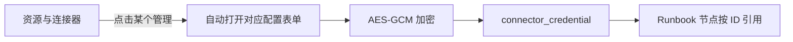
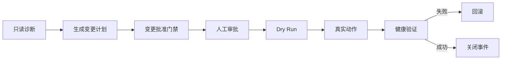

# PaiOps 连接器、审批、审计与安全实战

## 1. 实战目标

本文说明如何把 PaiOps 从“平台自身可运行”扩展到“连接真实运维环境”，同时不破坏最小权限边界。

交付环境的连接器页面和加密表单已经可用，但外部 Prometheus、Loki、Kubernetes 等凭证数量为 0，因为用户尚未提供这些系统的真实地址和认证信息。没有虚构外部连接结果。

## 2. 连接器页面与凭证页面的关系

“资源与连接器”展示能力目录，“凭证管理”保存实际连接信息：



点击 Kubernetes、MinIO、告警系统等卡片的“管理”后，会直接打开并选中对应类型，不需要再次手工寻找。

查询凭证时只返回：名称、类型、说明、已保存字段名和更新时间。Secret 值不会回显。

## 3. Prometheus

### 3.1 表单字段

- 服务地址；
- Bearer Token，可选；
- Basic Auth 用户名，可选；
- Basic Auth 密码，可选。

### 3.2 建议账号权限

只授予查询权限，不授予配置、规则和管理权限。运行 PromQL 只需要读取时间序列。

### 3.3 节点配置

在 Runbook 添加“Prometheus 查询”：

```promql
sum(rate(http_requests_total{job="payment-api",status=~"5.."}[5m]))
/
sum(rate(http_requests_total{job="payment-api"}[5m]))
```

配置超时，避免一次查询长期占用执行线程。高基数查询应先在 Prometheus 控制台评估。

## 4. Loki

### 4.1 表单字段

- 服务地址；
- Bearer Token 或 Basic Auth；
- Loki 租户 ID，可选。

### 4.2 查询示例

```logql
{namespace="prod", app="payment-api"} |= "ERROR" | json
```

为节点设置时间范围和条数上限。不要让 AI 自由生成无限时间范围的日志查询。

## 5. Kubernetes

### 5.1 表单字段

- Kubernetes API 地址；
- 默认命名空间；
- ServiceAccount Bearer Token；
- 集群 CA 证书，可选留存；
- kubeconfig，可选加密留存。

当前执行节点直接使用 API 地址和 Token。kubeconfig 主要用于后续管理，不代表系统会自动使用里面的所有高权限上下文。

### 5.2 创建只读 ServiceAccount

下面示例限制在 `paiops-demo` 命名空间：

```yaml
apiVersion: v1
kind: ServiceAccount
metadata:
  name: paiops-readonly
  namespace: paiops-demo
---
apiVersion: rbac.authorization.k8s.io/v1
kind: Role
metadata:
  name: paiops-readonly
  namespace: paiops-demo
rules:
  - apiGroups: [""]
    resources: ["pods", "pods/log", "events", "services", "configmaps"]
    verbs: ["get", "list", "watch"]
  - apiGroups: ["apps"]
    resources: ["deployments", "statefulsets", "replicasets"]
    verbs: ["get", "list", "watch"]
---
apiVersion: rbac.authorization.k8s.io/v1
kind: RoleBinding
metadata:
  name: paiops-readonly
  namespace: paiops-demo
subjects:
  - kind: ServiceAccount
    name: paiops-readonly
    namespace: paiops-demo
roleRef:
  apiGroup: rbac.authorization.k8s.io
  kind: Role
  name: paiops-readonly
```

应用并生成短期测试 Token：

```bash
kubectl apply -f paiops-readonly.yaml
kubectl -n paiops-demo create token paiops-readonly --duration=24h
kubectl config view --minify --raw
```

生产环境优先使用可轮换的短期凭证或外部密钥系统，不要长期复制集群管理员 kubeconfig。

### 5.3 写动作权限单独授予

扩缩容、滚动重启和镜像回滚需要 `patch`/`update`。不要把写权限直接加到只读账号。为写动作建立单独 ServiceAccount、单独凭证和单独审批策略。

最小示例：

```yaml
apiVersion: rbac.authorization.k8s.io/v1
kind: Role
metadata:
  name: paiops-controlled-writer
  namespace: paiops-demo
rules:
  - apiGroups: ["apps"]
    resources: ["deployments"]
    verbs: ["get", "patch", "update"]
```

仍然不要授予 `delete`、`create pods/exec`、Secrets 读取或集群级管理员权限，除非有独立评审。

## 6. MySQL

### 6.1 表单字段

- JDBC 地址；
- 用户名；
- 密码。

示例：

```text
jdbc:mysql://db.example.com:3306/payment?useSSL=true&serverTimezone=Asia/Shanghai
```

使用专门的健康检查账号：

```sql
CREATE USER 'paiops_health'@'指定来源IP' IDENTIFIED BY '单独强密码';
GRANT SELECT, SHOW VIEW, PROCESS ON *.* TO 'paiops_health'@'指定来源IP';
```

权限应按真实检查 SQL 再收窄。不要把生产 `root` 密码放到连接器。

## 7. MinIO / S3

### 7.1 表单字段

- MinIO / S3 地址；
- Access Key；
- Secret Key；
- 默认 Bucket；
- 是否使用 HTTPS。

Compose 内置 MinIO 已供 PaiOps 自身使用，地址是 `http://minio:9000`。连接器卡片用于接入额外对象存储，不要求重复配置内置实例。

生产环境应为 PaiOps 创建单独用户，只授权目标 Bucket 的必要读写操作。

## 8. Alertmanager 和告警 Webhook

### 8.1 两个方向

- Alertmanager → PaiOps：把告警推送到 PaiOps；
- PaiOps → Alertmanager/告警系统：保存服务地址和认证，用于后续联动。

PaiOps 接收地址：

```text
http://服务器地址/api/alerts/webhook
```

必须携带请求头：

```text
X-PaiOps-Webhook-Token: <PAIOPS_ALERT_WEBHOOK_TOKEN>
```

### 8.2 Nginx 注入头

部分 Alertmanager 配置不能方便地添加自定义头，可以在受控代理上注入：

```nginx
location = /paiops-alert-webhook {
    allow 192.0.2.20;
    deny all;

    proxy_set_header X-PaiOps-Webhook-Token <告警令牌>;
    proxy_set_header X-Real-IP $remote_addr;
    proxy_pass http://192.0.2.10/api/alerts/webhook;
}
```

令牌不要提交到 Nginx 公共模板仓库。建议使用权限受限的单独配置文件或密钥注入系统。

### 8.3 关联 Runbook

告警 label/annotation 可携带：

```yaml
labels:
  paiops_runbook_id: "12"
  paiops_auto_execute: "true"
```

只有全只读 DAG 才允许自动执行。含 Webhook 写操作、Kubernetes 动作、Shell 或其他风险节点的流程必须人工启动。

## 9. Webhook

Webhook 适合通知和低风险系统联动。表单支持：

- URL；
- Authorization；
- 用户名；
- 密码。

安全建议：

- 目标域名加入出站白名单；
- HTTPS；
- 独立 Token；
- 明确超时和重试上限；
- 请求包含幂等键；
- 不允许用户把任意内网地址当作 Webhook。

## 10. MCP 工具

MCP 页面用于配置受信工具。当前安全策略：

- 默认使用固定预设；
- 任意自定义进程命令默认禁止；
- 工具参数仍需校验；
- 联网搜索按 MCP 工具配置，不由模型节点直接执行任意系统命令；
- 工具执行应保留超时、结果和审计。

不要把“能调用工具”理解为“AI 可以获得服务器 root shell”。这两者必须严格隔离。

## 11. 审批实战

### 11.1 审批事实

高风险动作检查 `approval_request`：

- 必须属于当前执行记录；
- 状态必须是已批准；
- 不能过期；
- 动作范围必须匹配；
- 审批人和时间必须可审计。

普通输入字符串、节点参数或前端布尔值不能伪造批准。

### 11.2 推荐流程



审批人应先检查：目标环境、命名空间、资源名、期望副本/镜像、变更窗口、回滚方案和健康标准。

## 12. 审计日志

当前审计覆盖：

- 登录和密码修改；
- 执行入队、开始、完成、取消；
- 告警接入和事件状态；
- 审批决策；
- 凭证新增、更新、删除；
- 高风险动作结果。

审计记录包含操作者、资源类型、资源 ID、结果、来源 IP、时间和结构化详情。详情中不应写完整密码、Token 或 API Key。

## 13. 凭证轮换

建议周期：

| 凭证 | 建议 |
|---|---|
| DeepSeek Key | 按供应商策略或 90 天轮换 |
| Kubernetes 短期 Token | 24 小时或更短 |
| 数据库健康账号 | 90 天，支持双凭证过渡 |
| Webhook Token | 90～180 天 |
| Worker Token | 维护窗口轮换，backend/worker 同时更新 |
| Master Key | 不做普通轮换，必须走密文迁移方案 |

更换连接器密钥使用“凭证管理 → 更换密钥”。旧值不会回显。

## 14. Master Key 保护

`PAIOPS_MASTER_KEY` 丢失会导致所有已保存模型 Key 和连接器凭证无法解密。

必须：

1. `.env` 权限为 600；
2. 与数据库备份成对保存；
3. 备份副本离线加密；
4. 限制能读取服务器 `/opt/paiops-src/.env` 的账号；
5. 不在 Git、聊天、截图和普通工单中传播。

误改 Master Key 后不要继续保存凭证。停止 backend，恢复旧 Key，再验证解密。

## 15. 出站访问白名单

查看当前值：

```bash
cd /opt/paiops-src
grep '^PAIOPS_HTTP_ALLOWED_HOSTS=' .env
```

添加新目标后重建后端：

```bash
docker compose up -d --force-recreate backend worker frontend
```

策略应拒绝：

- 未批准域名；
- 文件协议和非 HTTP(S) 协议；
- 通过重定向跳到受限地址；
- 云元数据地址；
- 由普通用户任意指定的内网管理接口。

## 16. 验收清单

- [ ] 点击连接器“管理”直接打开对应类型；
- [ ] 保存后接口不回显 Secret；
- [ ] Prometheus/Loki 使用只读账号；
- [ ] Kubernetes 只读和写账号分离；
- [ ] Dry Run 不修改真实资源；
- [ ] 无审批的真实高风险动作被拒绝；
- [ ] 告警 Webhook Token 有来源 IP 限制；
- [ ] MCP 不能启动任意进程；
- [ ] 审计日志不包含明文密钥；
- [ ] 数据库备份与 Master Key 备份成对保存。
